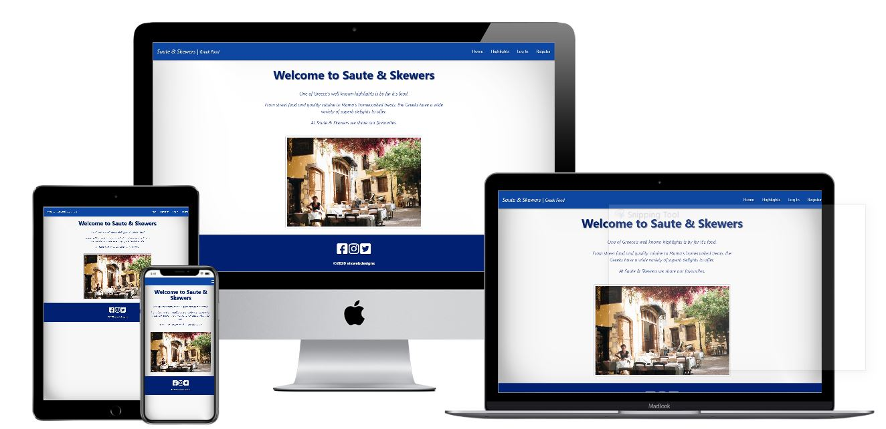

# Saute & Skewers | Greek Food 

*Share favourite Greek recipes with the Saute & Skewers community*

*Deployed to [Heroku](https://https://dashboard.heroku.com/) and stored in [Github](https://github.com/)*

## Contents

- [Introduction](#introduction)
- [Aim](#aim)
- [Purpose](#purpose)
- [UX](#ux)
- [The 5 Planes of content strategy](#the_5_planes_of_content_strategy)
- [Features](#features)
- [Technologies and Frameworks](#technologies_and_frameworks)
- [Defensive Design](#defensive_design)
- [Testing](#testing)
- [Evaluation](#evaluation)
- [Deployment](#deployment)
- [Credits and References](#credits_and_references)
- [Websites Reviewed](#websites_reviewed)
- [Acknowledgements](#acknowledgements)

## Introduction

With visitors from all over the world Greece is notably a favourite destination to all tourists. One of Greece's well known highlights is by far it's food.

From street food to quality cuisine and finally Mama's homecooked treats, the Greek have a wide variety of superb delights to offer.

This site allows the owner(admin) user to showcase their best loved recipes and hopes to gain traffic in the form of registered users to form a fantastic database of user favourites.

### Aim

To create a functional website that allows users to manipulate data using the CRUD functionality.

Prime technologies to be used in the project are HTML/CSS/Javascript/Python/Flask and MongoDB.

### Purpose

Saute & Skewers is a Greek food website where users can view recipes stored in the sites database, however registered users can also manipulate their own data using the create, read, update and delete - CRUD functionality.

It is hoped that all users to the site will find the website to be of interest and of use. Registered users have the added benefit of actively being part of a community.

## UX

## User stories

There are three types of users for this website, users stories for each are discussed below:

### Guest User

As a guest user I want to:
 - navigate around the site easily.
 - find a navigation bar that links to other pages when clicked. 
 - understand the sites purpose upon landing.
 - be able to view various content on the site.
 - be able to click social media icons to link out to other Saute & Skewer pages.
 - have the option to register to the site to see more.

### Registered Account

As a registered user I want to:
 - still be able to see the guest user content.
 - log into the site easily.
 - log out successfully.
 - have buttons to click to login, log out and submit data.
 - be able to add my own recipes to the site.
 - add recipes in an functional fashion.
 - edit my recipes if a mistake is made.
 - be able to delete my recipes should I wish.

### Admin User

As an admin user I want to:
- have full access to the site to ensure all content is viable.
- have access to be able to add more of my own recipes to the site.
- edit any content posted by me or by users of the site.
- have access to delete dormant or incomplete entries added to the site.

### Website Owner

The website owner would like users of the website to:
-  Interact with the site.
-  Enjoy the site and use it as a useful tool to find Greek food recipes.
-  Contribute to the site to create a vast selection of interesting data.

The website owner would like the website design to: 
- be clean and crisp looking with colors and a theme that portrays Greek Culture.
- have Greek images that creates an instant attraction to the site.
- have whitespace to create flow.
- have a footer containing social media icon links.

## The 5 Planes of content strategy

### Strategy

- Saute & Skewers is a functional website. It allows simple usage to provide a great way to add and share content. 

- It features the 3 core languages of web development HTML, CSS and Javascript, as well as Python and Flask. It is deployed to a MongoDB database. 

- There is a clear brand that draws users and entices interactions.

- Users who discover Saute & Skewers, easily grasps it's concept - how it works and what it's output is.

- Saute & Skewers has the potential of not only being a content sharing site, it could potentially become a business site. Adding a few addtional features and marketing the site well could mean Saute & Skewers could generate revenues.

- During research there where other sites found that had the same concept, although the Greek aspect was minimal. 

### Scope 

- The site was developed with the intention of allowing users to build a database of their own recipes.
- The database of choice to build with was NoSQL - MongoDB.
- It was scoped to provide ease of use.
- Have the CRUD functonality.
- House a home page, registration page, log in page, log out page.
- Be responsive on all devices.
- Be visually appealing that incorporated Greek culture in the front-end design.

### Structure

- Saute & Skewers site structure was created from the UX user stories - therefore developed with pages that where required to enable users to sign up and add data.
- All pages are designed identically with 3 sections - a Navbar, content area and a footer.
- The Home page has a main image and 'Welcome' text. 
- The Highlights page shows a selection of recipe content and images for all users to view.
- The Register page has a basic registration form with a button and a link to login if already registered.
- The Login page has a basic login form with a button and a link to register if not already a member. 
- Once logged in the Login page becomes a Profile page, this shows a 'Welcome back' text, a few enticing words and a link to the 'Add Recipe' Page
- The Add Recipe page is where users add their own recipes once they submit the recipe it takes them to the Recipes page.
- The Recipes page is the home of user recipes already added. This is data stored in the database.
- Finally the Log out page displays, a 'You have been logged out message' and the same Log in view.

### Skeleton

Wireframes where created with only the main pages of the site in mind. Therefore only four where initially created.

These Desktop and Mobile wireframes demonstrate the basic design and structure of the site and the required elements each page needed. 

All wireframes were created using [Balsamiq](https://balsamiq.com/wireframes/).

Desktop:

[Home](wireframes/base-desktop.png)
[Register](wireframes/register-desktop.png)
[Login](wireframes/login-desktop.png)
[Recipes](wireframes/recipes-desktop.png)

Mobile:

[Home](wireframes/base-mobile.png)
[Register](wireframes/register-mobile.png)
[Login](wireframes/login-mobile.png)
[Recipes](wireframes/recipes-mobile.png)

### Surface 

Front-end visuals where based on:
 - A great brand design.
 - Traditional Greek colours.
 - Powerful images.
 - Enlighting text in which it is anticipated that the user would feel positive and maybe daydream to another world.

The typography colours and fonts therefore where important to promote traditional greek culture, with a tempting, feel good reaction.
With the Greek flag and its symbolic colours of blue and white, the sites aim was to incorporate this into its design. 

Users will see that Saute & Skewers chose a simplistic design with ample whitespace to provide an instant attraction on site opening.

 - colour: #0d47a1 blue darken-4 from Materialize CSS
 - colour: rgb(2, 32, 114) from Colorcodehex 
 - font: Arial from Google Fonts

## Features 

### Existing Features

Multiple pages: The site has multiple responsive pages, using the mobile first approach. 

User friendly: Each page has its own purpose and uses a simple mouse movement on desktop and scroll movement on mobiles/tablets to provide easy navigation. 

Fonts and Colours: Simplistic design incorporating only minimal colour and text.

Navbar: A Materialize fixed Navbar at the top on desktop and a side navbar on mobiles and tablets. The navbar links to the site pages, this changes dependent on the users status: Logged in, Logged out.

Button: Chosen from Materialize the buttons when clicked confirm user actions. Buttons are big and provide instruction. 

Forms: Code from Materialize. The Register, Log in, Add recipe pages all have forms to complete. The forms are self explanatory.

Icons: Font Awesome icons are used on the form fields to provide instructions aswell as for design. 

Images: Bold and relevant images where used in the design. Selected images provide a luxury feel.

Hyperlink: There is a hyperlink on the 'register page', 'login page' and 'profile page' to revert user to an alternative area dependent on their next wanted action.

Flash Messages: Flash messages provide feedback to users. User that have an unsuccessful login will recieve "username or password incorrect".
The 'Registered users' will see, "Welcome USERNAME" on login and "You have successfully logged out" on log out.

Social Media Links: Saute & Skewers has various Social Media accounts therefore icons for these are found in the footer.

### Future Features

Saute & Skewers - Future features could include:

- Having a larger database of greek recipes for guest users to view.
- An image field on Add recipe page where users can upload images of their own Greek foods to their recipes.
- User profile to be extended to allow users to upload images and information about them that other registered users can see.
- Have a logo, incorporate the Saute & Skewers text into something more memorable.
- Add a favicon so the sites logo is displayed in the browser tab for ease of navigation.
- A badge or icon level that registered users of the site could achieve, when X number of entries have been added - i.e - Top Contributer.
- A review score or like element that the community of users can click on, if they like or have tried a recipe posted by others.
- Response section to provide users with feedback on added recipes.
- Forgotton password feature, so passwords can be reset.
- A blog that promotes more of Greece - locations, its culture aswell as it foods.
- A messenger area where registered users can chat to each other live on the site.
- An e commerce shop where users could order greek foods and merchandise.

## Technologies and Frameworks 

#### Technologies
- [HTML](https://www.w3schools.com/whatis/whatis_html.asp)
- [CSS](https://www.w3schools.com/css/css_intro.asp)
- [Javascript](https://www.w3schools.com/whatis/whatis_js.asp)
- [Python](https://www.python.org/doc/essays/blurb/)
- JSON

#### Frameworks
- [Flask](https://palletsprojects.com/p/flask/)
    - The web application framework used in the project to provide tools and libraries.

- [Werkzeug](https://palletsprojects.com/p/werkzeug/)
    - A web application library in Flask that was used to for secure authentication using password hashing.

- [Materialize](https://materializecss.com/)
    - A web based front-end framework that assists in responsiveness and styling that was used throughout the project.

- [JQuery](https://jquery.com/)
    - The JavaScript library used within the Materialize framework.

#### Database
- [MongoDB](https://www.mongodb.com/cloud/atlas/)
    - A document based database, and the type of databased used when developing this project

#### Text Editor
- [Gitpod](https://gitpod.io/)
    - A cloud based IDE, that uses prebuilt workspaces.

#### Version Control
- [Git](https://git-scm.com/)
    - Version control system that works within the Gitpod terminal. Used to commit and push recent code to GitHub.

#### Hosting Platform
- [Heroku](https://https://dashboard.heroku.com/)
    -The application platform used for the live deployed site.

- [Github](https://github.com/)
    - A repository store, used to house the sites repository.

#### Developer Tools
- [Google Dev Tools](https://developers.google.com/web/tools/chrome-devtools)

#### Colorcodehex
- [Colorcode](https://www.colorcodehex.com/022072.html)

#### Font Awesome
- [Font Awesome](https://fontawesome.com/)
    - A popular site that provides icons for developers to use for UX.

#### RandomKeygen
- [RandomKeygen](https://www.randomKeygen.com/)
  - Site to select a secure SECRET_KEY password.

#### Validation sites
- [W3C Markup Validation](https://validator.w3.org/)
- [Jshint](https://jshint.com/)
- [PEP8](http://pep8online.com/)

## Defensive Design

*Defensive design is the practice of planning for contingencies in the design stage of a project or undertaking. Essentially, it is the practice of anticipating all possible ways that an end-user could misuse a device, and designing the device so as to make such misuse impossible, or to minimize the negative consequences.*
[Wikipedia](https://en.wikipedia.org/wiki/Defensive_design/)

Defensive design was used in the projects 'Form' elements. When entering text to the sites form areas the defensive design can be seen in action.
To ensure the user inputs are correct they are validated by the class 'validate' and the inputs 'minlength', 'maxlength' and 'pattern'.

### Testing

Manual Testing was undertaken during the creation of this site. 
Testing included tests on various devices for responsiveness and UX aswell as testing code for validation and best practice.
Testing sites used:
 - W3C Markup Validator
 - Pep8 Compliance

Below highlights the main issues and bugs found during the development.

#### Issue 1

Initial routing wasnt correct, data was coming through to recipes.html as id forgotton the index.html

#### Issue 2

#### Issue 3

Needed more pages adding to site to allow for guest user and session user interaction

#### Issue 4

Materialize Carousel wasnt loading well, the links kept breaking therefore removed after various tests when the developer couldnt fix.

#### Issue 5

The navbar and footer background should have been the same colour. However the developer could not get the colours to match using the Materialize
colour #2196f3 blue. Therefore decided to use a deeper blue in CSS file, the :rgb(2, 32, 114). 

#### Issue 6

Images on a few pages are not natural looking,  they are to large. For instance on the 'Recipes' page, this is far to big and needs to be reduced.
Due to time constraints this was not able to be rectified.

Validation sites
- When validating the code for HTML and CSS errors where found and rectified. Mostly simple errors and typos.
- JShint for JS validation found there where xxx warnings, however many was of the same error. Unfortunately a fix wasnt implemented due to lack of understanding on how to resolve them and to time constraints. 
  Here are the errors 
  - **
  

### Browsers tested

- Chrome: Using Google Developer Tools - Chrome was used for testing on Laptop, Tablet and Android devices.

- Safari: Safari wasn't used for testing on an I phone or Mac, due to not having physical access to these type of devices. However they were viewed on Google Dev Tools.

### Devices tested

On final testing session the below devices where used here are the outcomes.

Mobile:
- Android - Samsung Galaxy A40 - Outcome: Site works perfectly. No bugs found. All is responsive.
- Android - Samsung Galaxy A20 - Outcome: Site works perfectly. No bugs found. All is responsive.
- Android - Samsung Galaxy S10 - Outcome: Site works perfectly. No bugs found. All is responsive.

Laptop:
- Toshiba Satellite C850 - Outcome: Site works perfectly. No bugs found. All is responsive. 

## Evaluation

- Overall the design and development of this site is suitable for its intended purpose.
- It has all.............. the basic requirements of a functional website and meets .............the project criteria.

- Again to do external commitments the site is not fully complete. The developer is aware of various aspects that dont function as intended or is missing.
    - The CRUD Functionality is in place, however the developer struggled to wire this up correctly. Therefore Edit and Delete buttons do not do anything.
    - The Edit Recipies page doesnt show.................
- Most of the user stories where met, with the exception of .... editing user content.. probabably better to just delete or block user..............
- Images on the site are not all suitable for the sites look. This is something that needs changing so it gives the site a better visuals.
- Many future features could be added to provide more interactive activity, functionality and imagery.
- Branch testing - No branch testing was undertaken....
- Manual Testing was undertaken .....Werkzeug ..........................more testing was required..
- Some front-end design changes where made during the build due to varying factors:
    - Materialize image carousel, looked good but didnt load well. Also the developer found it difficult to change the prebuilt images and the links kept breaking.
    - The site was to have 4 pages initally but it was discovered early in development that more pages would be required.

## Deployment

#### Heroku:

The project is deployed to Heroku. It uses the automatic deployment method via Github, using your Github repository.
Below shows the steps to deploy on Heroku:

1. Heroku requires certain dependencies and applications to run our application. There we need to tell it whats required. 
   In the terminal type 
   - $ pip3 freeze --local > requirements.txt
   - $ echo web: python app.py > Procfile
2. Register on the Heroku website - [Heroku](https://www.heroku.com/) or Log in for existing users.
3. From the dashboard click 'New' and 'Create new app'.
4. Enter your unique 'App name' (Heroku practice is for it to be lowercase and to use hyphen (-) instead of spaces).
5. Select your region, then click 'Create App'.
6. Create app directs to Heroku's 'Deploy' tab, select the deployment method of 'GitHub'.
7. Your Github profile should be displayed, enter your repository name here and click 'Search'. (Idealy your Heroku app name and your repository name should be the same).
8. Your repository should display here and a 'Connect' button appears to connect to your app.
9. Before you click 'Connect', head over to 'Settings' tab and scroll down to the 'Config Vars' section. As we have contained our Environment Variables
   in our env.py file we need to tell Heroku these in a secure manner.
   Add your variables to the below Key/Value pairs:
    - IP
    - PORT
    - SECRET_KEY
    - MONGO_URI
    - MONGO_DBNAME

10. Final step before we connect to Heroku is to push our new files 'requirements.txt' and 'Procfile' to the repository.
    Back in the terminal have a check of the workspace status, type: git status. this will show your new pending files.
    Continue in the terminal and type:
    - $ git add requirements.txt
    - $ git commit -m "Added requirements.txt"
 
   - $ git add Procfile
   - $ git commit -m "Added Procfile"

   - $ git push

11. Go back to Heroku 'Deploy' tab, click 'Enable Automatic Deploys' in the section Automatic Deploys. Finally under Manual Deploy section click 'Deploy Branch'.
    Heroku will now receive the code from GitHub and start building the app using the required packages.
    Once built you will receive the message 'Your app was successfully deployed' then can click 'View' to launch your new app.

12. Your deployed app is now available and should update automatically everytime you push to the Github repository.

#### Github:

In [GitHub](https://github.com/) we can view the repository. 

Should you want to 'Fork' or 'Clone' this repository to use as a base template for your own projects you can do so.
 - To 'Fork':
1. Head to the repository, on the top right click 'fork' button.
   You now have your own copy of the forked repository in your Github account.

If you want to run this project locally, we must clone the project.
- To 'Clone':
1. Under the repository name, click the 'Code' button on the right.
2. A dropdown 'Clone with HTTPs' section appears, here copy the clone URL for the repository.
3. In your local IDE open Git Bash.
4. Change the current working directory to the location where you want the cloned directory to be made.
6. Type 'git clone' and paste the URL you copied.

- Example: git clone  = https://YOURNAME.github.io/saute-and-skewers-greekfood/

6. Press Enter. Your local clone is now created.

## Credits and References

Personal credits go out to the following people:
- Spencer Barriball and excellent mentor who guided and assisted in the development of the project from inception to completion. 

Tutor Support
- Tim Nelson from tutor support who clarified issues within Cloud 9 videos and Gitpod usage.

Web References
- [Wikipedia](https://en.wikipedia.org/wiki/Defensive_design/)
    - Used to determine the exact meaning of defensive design.

#### Websites reviewed

Websites reviewed and used during the creation of this project.

- [Balsamiq](https://balsamiq.com/)
  - Used for creating the wireframe mocks.
  
- [Bootstrap](https://getbootstrap.com/)
  - Researching carousel functionality, although wasnt used in the project.

- [Codeacademy](https://www.codeacademy.com/articles/what-is-crud/)
  - Article referring to "what is CRUD and its uses".

- [Google Fonts](https://www.fonts.google.com/basic-syntax/)
  - Used for choosing inital font.

- [Jshint](https://jshint.com/)
  - Validation testing of Javascript.

- [Markdownguide](https://www.markdownguide.org/basic-syntax/)
  - This website was used to refresh knowledge on how to use Markdown.

- [Materialize](https://materializecss.com/)
  - Documentation and code on Navbar, CSS colours and buttons.

- [Pexels](https://www.pexels.com/)
  - Used for site Images.

- [Python](https://www.python.org/doc/essays/blurb/)
    - Reviewed for deeper understanding of the language.

- [RandomKeygen](https://www.randomKeygen.com/)
  - Used for Fort Knox password.

- [StackOverflow](https://stackoverflow.com/)
  - Various research throughout.

- [Techsini](https://techsini.com/multi-mockup/)
  - Used for Mock Up Images.

- [Tech with Tim](https://www.youtube.com/watch?v=mqhxxeeTbu0&list=PLzMcBGfZo4-n4vJJybUVV3Un_NFS5EOgX)
    - A series of You Tube tutorial videos to gain greater understanding of Flask.

- [Werkzeug](https://palletsprojects.com/p/werkzeug/)
    - Used to gain knowledge in authentication and secure passwords.

- [W3Schools](https://www.w3schools.com/basic-syntax/)
  - Reviewed and used frequently throughout the design of this project.

- [W3C Markup Validation](https://validator.w3.org/)
  - Validation testing of HTML and CSS.

## Acknowledgements

[Slack](https://slack.com/intl/en-gb/) and the wonderful community of students past and present for thier motivational pushes.

My mentor Spencer Barriball for his profound knowledge and assistance in the development of the website.

[Code Institute](https://codeinstitute.net/) Tutor Support for guidance and assistance when facing difficulties.

The developers own personal experiences during the creation and development of this project.

*created for education purposes only*

